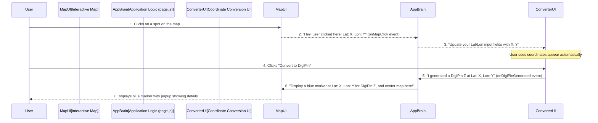

# Chapter 1: Interactive Map Interface

Have you ever looked at a map and wished you could just point to a spot and instantly get its exact location details, or see where a special code refers to? That's exactly what the "Interactive Map Interface" in DigiPin helps you do!

### What's the Big Idea? (Why do we need a map?)

Imagine you're trying to describe a very specific place, like "the exact center of the park where we had that picnic." It's hard to explain with just words, right? You might use an address, but what if there's no address, or you need to be super precise?

This is where the Interactive Map Interface comes in handy. It's the visual heart of our DigiPin application. Think of it as your digital globe, helping you visually pinpoint locations and understand where the DigiPins refer to.

**Here's the main problem it solves:**
*   **Finding exact coordinates:** Instead of guessing or looking up numbers, you can simply click on any spot on the map to get its precise latitude and longitude.
*   **Visualizing DigiPins:** If someone gives you a DigiPin code, how do you know where that place *is*? The map shows you by placing a marker right on that spot.

Let's use a simple example: You want to find the DigiPin for your favorite coffee shop, but you only know where it is on a map, not its exact coordinates. The Interactive Map Interface allows you to click on the coffee shop's location on the map, get its coordinates automatically, and then use those coordinates to generate a DigiPin!

### Key Concepts of Our Interactive Map

The Interactive Map Interface isn't just a static picture. It has a few smart features that make it truly helpful:

1.  **The Visual Map:** This is the basic map you see on your screen. You can move it around (pan) and zoom in or out, just like using Google Maps or Apple Maps. It gives you a clear geographical background for everything you do.

2.  **Click to Select Coordinates:** This is a super neat trick! Instead of typing long numbers for latitude and longitude, you can just click anywhere on the map. The map then instantly tells the application the exact coordinates of where you clicked. This makes selecting locations quick and error-free.

3.  **Displaying Markers:** When you use DigiPin to convert information (like converting coordinates to a DigiPin code, or decoding a DigiPin code back into coordinates), the map doesn't just sit there. It places a special "pin" or "marker" on the map at the exact location it's talking about.
    *   **Blue Markers:** Show where a DigiPin was *generated* from your selected coordinates.
    *   **Green Markers:** Show where a decoded DigiPin *points to*.
    This visual feedback helps you immediately see and confirm the location.

4.  **Geographical Context:** By seeing the location on a map, you get a better sense of where it is in the real world. Is it in a city? Next to a river? In a remote area? The map provides that context instantly.

### How to Use the Map Interface

Using the map is very straightforward:

1.  **Open DigiPin:** When you open the DigiPin application, you'll see the Interactive Map on the right side of your screen.
2.  **Select a Location:** Want to find coordinates? Simply **click anywhere on the map**. You'll see the latitude and longitude automatically fill into the "Coordinate to DigiPin" input fields on the left side of your screen. This is your input for generating a DigiPin!
3.  **See Your Results:** After you've converted coordinates to a DigiPin (or vice-versa), watch the map! A colorful marker will appear, showing you exactly where that DigiPin or those coordinates are located. A small box (called a "popup") will also appear next to the marker, giving you details like the DigiPin, latitude, and longitude.

Let's see a tiny peek at how the main application screen uses the map:

```javascript
// From: src/app/page.js

export default function Home() {
  // ... other setup code ...

  const [mapCenter, setMapCenter] = useState([20.5, 78.9]); // Map starts centered on India
  const [mapZoom, setMapZoom] = useState(5); // And at a certain zoom level
  const [marker, setMarker] = useState(null); // No marker at first
  const [selectedCoords, setSelectedCoords] = useState({ lat: '', lon: '' });

  // This function runs when you click on the map
  const handleMapClick = (lat, lon) => {
    // We update the selected coordinates based on where you clicked
    setSelectedCoords({ lat: lat.toFixed(6), lon: lon.toFixed(6) });
  };

  // This function runs when a DigiPin is generated or decoded
  const handleCoordinateGenerated = (lat, lon, digiPin, address) => {
    const newMarker = {
      lat: parseFloat(lat), lon: parseFloat(lon),
      digiPin, address, type: 'digipin' // 'digipin' type for blue marker
    };
    setMarker(newMarker); // Show the marker on the map
    setMapCenter([newMarker.lat, newMarker.lon]); // Center map on the marker
    setMapZoom(12); // Zoom in on the marker
  };

  // ... similar handleDigiPinDecoded function ...

  return (
    // ... layout code ...
    <div className="h-96 lg:h-[600px]">
      <MapComponent
        center={mapCenter}
        zoom={mapZoom}
        marker={marker} // This tells the map where to put a pin
        onMapClick={handleMapClick} // This tells the map what to do when clicked
      />
    </div>
    // ... rest of the layout ...
  );
}
```
**What's happening here?**
*   When you **click the map**, the `handleMapClick` function is called. It takes the `lat` (latitude) and `lon` (longitude) of your click and saves them. This then updates the input fields for coordinate conversion.
*   When you **generate a DigiPin** or **decode one**, functions like `handleCoordinateGenerated` are called. These functions create a `marker` object (which holds the location and details) and tell the map to `setMarker`, `setMapCenter`, and `setMapZoom`. This makes the map show the pin and move to focus on it.

### What's Under the Hood? (How does it work?)

Let's quickly peek behind the curtain to understand how the map works its magic.

Imagine you're the user, and the map is a smart assistant.



Here's a breakdown of the steps:

1.  **You Click:** When you click anywhere on the Interactive Map, the map component (which uses a library called Leaflet) detects this click.
2.  **Map Tells App:** The map then tells the main application (`page.js`) exactly where you clicked (latitude and longitude). This communication happens using something called `onMapClick`.
3.  **App Updates Input:** The `page.js` then takes these coordinates and automatically fills them into the "Coordinate to DigiPin" input boxes on the left side of your screen. No typing needed!
4.  **You Convert:** You then use these pre-filled coordinates and click "Convert to DigiPin".
5.  **Converter Tells App:** Once the DigiPin is generated (or decoded), the converter component tells `page.js` the result (the DigiPin, the coordinates, and any address found).
6.  **App Updates Map:** `page.js` then updates the map component, telling it: "Hey, put a marker at *this* specific latitude and longitude, show *this* DigiPin in its popup, and zoom in on that spot!"
7.  **Map Shows Marker:** The map component draws a nice, colorful marker at the exact location, confirming your conversion visually.

### A Closer Look at the Code

The Interactive Map is built using a few key pieces. The core map logic lives in `src/components/MapWrapper.jsx`, and it's then used by `src/components/MapComponent.jsx` (which helps it load correctly in web browsers) and finally displayed on `src/app/page.js`.

Let's simplify `src/components/MapWrapper.jsx`:

```javascript
// From: src/components/MapWrapper.jsx

import { MapContainer, TileLayer, Marker, Popup, useMapEvents } from 'react-leaflet';
import L from 'leaflet'; // A library for interactive maps

// ... (code to fix default marker images) ...

// This small helper listens for clicks on the map
function MapEventHandler({ onMapClick }) {
  useMapEvents({
    click: (e) => { // When a click happens...
      const { lat, lng } = e.latlng; // Get the latitude and longitude
      onMapClick(lat, lng); // Send it up to the main application
    },
  });
  return null; // This component doesn't draw anything itself
}

const MapWrapper = ({ center, zoom, marker, onMapClick }) => {
  // ... (code for createCustomIcon - makes our markers blue/green circles) ...

  return (
    <MapContainer
      center={center} // Where the map is centered
      zoom={zoom}     // How zoomed in or out the map is
      className="w-full h-full"
    >
      <TileLayer // This is the actual map imagery (like satellite or street view)
        attribution='&copy; <a href="https://www.openstreetmap.org/copyright">OpenStreetMap</a> contributors'
        url="https://{s}.tile.openstreetmap.org/{z}/{x}/{y}.png"
      />

      <MapEventHandler onMapClick={onMapClick} /> {/* Our click listener */}

      {marker && ( // If there's a 'marker' to show...
        <Marker
          position={[marker.lat, marker.lon]} // Place it at these coordinates
          icon={createCustomIcon(marker.type)} // Use our custom blue/green icon
        >
          <Popup> {/* When you click the marker, this little box appears */}
            <div>
              <strong>DigiPin:</strong> {marker.digiPin} <br/>
              <strong>Latitude:</strong> {marker.lat} <br/>
              <strong>Longitude:</strong> {marker.lon}
            </div>
          </Popup>
        </Marker>
      )}

      {/* ... (code for map legend and click instruction text) ... */}
    </MapContainer>
  );
};

export default MapWrapper;
```

**Breaking down the `MapWrapper.jsx`:**

*   **`MapContainer`**: This is the main box that holds the entire map. You tell it where to `center` and how much to `zoom`.
*   **`TileLayer`**: This is what makes the map *look* like a map! It fetches map images (tiles) from a service like OpenStreetMap and displays them. Without this, you'd just have a blank box.
*   **`MapEventHandler`**: This is a clever little helper. It uses something called `useMapEvents` (from the `react-leaflet` library) to "listen" for when someone `click`s on the map. When a click happens, it gets the latitude (`lat`) and longitude (`lng`) and then uses the `onMapClick` function (which was given to it by `page.js`) to send these coordinates back to the main application.
*   **`Marker` and `Popup`**: When `page.js` tells `MapWrapper` that there's a `marker` to display, this part of the code springs into action.
    *   `Marker` places a pin at the `position` (latitude and longitude) you give it.
    *   `icon={createCustomIcon(marker.type)}` makes sure our pins are those cool blue or green circles, not just the default red pins.
    *   `Popup` creates the little information box that appears when you click on the marker.

This setup makes the map dynamic and responsive to your actions, whether you're clicking to select coordinates or viewing where a DigiPin points!

### Conclusion

The Interactive Map Interface is your visual command center in DigiPin. It simplifies getting coordinates by letting you click directly on a map, and it provides clear feedback by showing markers for your generated DigiPins or decoded coordinates. It's designed to make working with geographical data intuitive and visually engaging.

Now that you understand how to use the map to select coordinates, our next step is to learn how to actually *convert* those coordinates into a DigiPin, or turn a DigiPin back into coordinates. Let's move on to the [Coordinate Conversion UI](02_coordinate_conversion_ui_.md)!

---

<sub><sup>Generated by [AI Codebase Knowledge Builder](https://github.com/The-Pocket/Tutorial-Codebase-Knowledge).</sup></sub> <sub><sup>**References**: [[1]](https://github.com/Kvr-10/Digipin/blob/46da315d3734884bac31f262a43c323f70b4fddd/src/app/page.js), [[2]](https://github.com/Kvr-10/Digipin/blob/46da315d3734884bac31f262a43c323f70b4fddd/src/components/MapComponent.jsx), [[3]](https://github.com/Kvr-10/Digipin/blob/46da315d3734884bac31f262a43c323f70b4fddd/src/components/MapWrapper.jsx)</sup></sub>