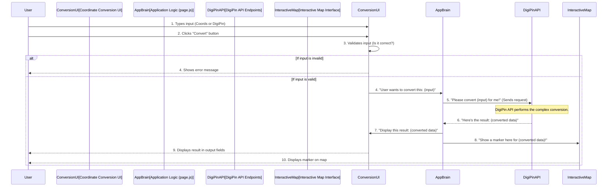

# Chapter 2: Coordinate Conversion UI

In [Chapter 1: Interactive Map Interface](01_interactive_map_interface_.md), we learned how to use the map to visually find a spot and even automatically get its coordinates. That's a great start! But once you have those coordinates, or if someone gives you a special DigiPin code, how do you actually *convert* them? How do you turn `28.6139` Latitude and `77.2090` Longitude into a DigiPin, or turn `FC9-8J3-2K45` back into coordinates?

This is where the "Coordinate Conversion UI" comes in!

### What's the Big Idea? (Your Digital Translator)

Think of the Coordinate Conversion UI as the **digital translator** inside DigiPin. It's the part of the application where you directly tell DigiPin: "Here are some coordinates, give me the DigiPin!" or "Here's a DigiPin, tell me where it is!"

**The main problem it solves:**
*   **Simple, one-off conversions:** You don't need to understand complex math or coding. You just type in what you have (coordinates or a DigiPin) and click a button.
*   **Clear results:** It shows you the converted information, like the DigiPin, latitude, longitude, and even a readable address.
*   **Error handling:** If you type something wrong, it gently tells you what's incorrect.

Let's use a simple example: You just clicked on your friend's house on the map, and now you have its precise latitude and longitude. The Coordinate Conversion UI is where you'll see those numbers automatically appear, and then you'll use it to instantly generate the unique DigiPin for that spot. Or, if a friend gives you a DigiPin, this is where you'll type it in to find out *exactly* where that spot is on the map and what its address is.

### Key Concepts of Our Conversion UI

The Coordinate Conversion UI isn't just a simple box. It's built with a few smart features to make your life easier:

1.  **Input Fields:** These are the text boxes where you type your Latitude, Longitude, or DigiPin code. They're designed to be easy to use.
2.  **Conversion Buttons:** These are the "magic" buttons you click (like "Generate DigiPin" or "Find Coordinates") to start the conversion process.
3.  **Output Display:** After you click the button, this is where your results (the generated DigiPin, or the decoded coordinates and address) neatly appear.
4.  **Input Validation:** DigiPin is smart! It checks your input to make sure it's correct. For example, it checks if your latitude and longitude numbers are within a valid range, or if your DigiPin has the right length and characters. This prevents mistakes.
5.  **Error Messages:** If something isn't right (like a typo in your DigiPin), the UI will show a clear message explaining the problem so you can fix it.
6.  **Address Lookup:** After converting, DigiPin often tries to find a human-readable address for the location, using a service we'll talk about in [Chapter 5: Geocoding Service Integration](05_geocoding_service_integration_.md).
7.  **Clear & Copy Buttons:** Handy buttons to quickly clear the form or copy the generated DigiPin to your clipboard!

### How to Use the Coordinate Conversion UI

You'll find two main sections in the Coordinate Conversion UI: one for converting coordinates to DigiPin, and another for converting DigiPin to coordinates.

#### Scenario 1: Coordinates to DigiPin

Let's say you have coordinates (e.g., from clicking on the map as we learned in Chapter 1) and you want to get a DigiPin.

1.  **Open DigiPin:** When you open the application, on the left side, you'll see the "Coordinates to DigiPin" section.
2.  **Enter Coordinates:**
    *   If you **clicked on the map**, the Latitude and Longitude fields will automatically fill in! That's the smart connection with the [Interactive Map Interface](01_interactive_map_interface_.md).
    *   If you know the coordinates, you can also **type them directly** into the "Latitude" and "Longitude" fields.
    *   You can even click "Use Current Location" to let your browser find your current coordinates!
3.  **Click to Generate:** Click the blue "Generate DigiPin" button.
4.  **See the DigiPin:** The generated DigiPin will appear in a green box below the button. You'll also see a human-readable address and a handy "Copy" button! And remember, a blue marker will appear on the map to show you where this DigiPin points!

**Example Input and Output:**

*   **Input (Latitude):** `28.6139`
*   **Input (Longitude):** `77.2090`
*   **You Click:** "Generate DigiPin"
*   **Output:** A DigiPin like `FC9-8J3-2K45` appears. The map updates with a blue marker, and the address might show "New Delhi, Delhi, India".

#### Scenario 2: DigiPin to Coordinates

Now, let's say a friend gives you a DigiPin code like `FC9-8J3-2K45`, and you want to know where it is.

1.  **Open DigiPin:** On the left side, scroll down to the "DigiPin to Coordinates" section.
2.  **Enter DigiPin:** Type the DigiPin code into the "DigiPin Code" field. Don't worry about the hyphens; DigiPin will add them for you!
3.  **Click to Find:** Click the green "Find Coordinates" button.
4.  **See the Location:** The exact Latitude and Longitude will appear, along with the address. A green marker will also appear on the map, showing you the exact location of that DigiPin!

**Example Input and Output:**

*   **Input (DigiPin Code):** `FC9-8J3-2K45`
*   **You Click:** "Find Coordinates"
*   **Output:** Latitude `28.6139`, Longitude `77.2090` appears. The map updates with a green marker, and the address might show "New Delhi, Delhi, India".

### What's Under the Hood? (How Does It Work?)

Let's peek behind the curtain to see the steps when you use the Coordinate Conversion UI:



Here's a step-by-step breakdown:

1.  **You Enter and Click:** You type your information into the input fields and click the conversion button.
2.  **UI Validates:** The Conversion UI first quickly checks if your input makes sense (e.g., are the coordinates numbers? Is the DigiPin the right length?). If not, it shows you an error message right away.
3.  **UI Talks to App Brain:** If your input is good, the Conversion UI tells the main "Application Logic" (which lives in `src/app/page.js`) what you want to convert.
4.  **App Brain Talks to DigiPin API:** The `page.js` then sends your request to the "DigiPin API Endpoints" (our smart backend system, which we'll explore in [Chapter 3: DigiPin API Endpoints](03_digipin_api_endpoints_.md)). This API is where the actual mathematical conversion happens.
5.  **API Sends Back Results:** The DigiPin API does its magic and sends the converted data (like the DigiPin or the coordinates) back to `page.js`.
6.  **App Brain Updates UI and Map:** `page.js` then takes these results and tells *both* the Conversion UI (to show the numbers in the output boxes) *and* the [Interactive Map Interface](01_interactive_map_interface_.md) (to place a marker and zoom to the location) to update.
7.  **You See the Magic:** The results appear in the UI, and a marker appears on the map, confirming your conversion!

### A Closer Look at the Code

The Coordinate Conversion UI is primarily handled by two components:
*   `src/components/CoordinateToDigiPin.jsx`: For turning coordinates into DigiPins.
*   `src/components/DigiPinToCoordinate.jsx`: For turning DigiPins into coordinates.

These components are then used together in `src/app/page.js`, which is like the "command center" of our application.

Let's look at a simplified version of `CoordinateToDigiPin.jsx`:

```javascript
// From: src/components/CoordinateToDigiPin.jsx

import { useState, useEffect } from 'react';

const CoordinateToDigiPin = ({ onDigiPinGenerated, selectedCoords }) => {
  const [latitude, setLatitude] = useState(''); // Stores the latitude from input
  const [longitude, setLongitude] = useState(''); // Stores the longitude from input
  const [digiPin, setDigiPin] = useState(''); // Stores the generated DigiPin
  const [error, setError] = useState(''); // Stores any error messages

  // This runs when you click on the map!
  useEffect(() => {
    if (selectedCoords.lat && selectedCoords.lon) {
      setLatitude(selectedCoords.lat); // Update latitude from map click
      setLongitude(selectedCoords.lon); // Update longitude from map click
      setError('');
    }
  }, [selectedCoords]); // Only re-run if selectedCoords changes

  // This function checks if the coordinates are valid
  const validateCoordinates = (lat, lon) => {
    const latNum = parseFloat(lat);
    const lonNum = parseFloat(lon);
    if (isNaN(latNum) || isNaN(lonNum)) return 'Invalid numbers';
    if (latNum < 2.5 || latNum > 38.5) return 'Latitude out of range';
    // ... more validation checks ...
    return null; // No error
  };

  // This function runs when you click the "Generate DigiPin" button
  const handleSubmit = async (e) => {
    e.preventDefault(); // Stop the page from refreshing
    const validationError = validateCoordinates(latitude, longitude);
    if (validationError) {
      setError(validationError); // Show error if validation fails
      return;
    }

    // Now, send the request to our backend API!
    try {
      const response = await fetch(`/api/encode-digipin?lat=${latitude}&lon=${longitude}`);
      const data = await response.json();

      if (!response.ok) {
        throw new Error(data.error || 'Failed to generate DigiPin');
      }

      setDigiPin(data.digiPin); // Save the generated DigiPin
      // Tell the main app (page.js) that we found a DigiPin
      onDigiPinGenerated(latitude, longitude, data.digiPin, data.address);
    } catch (err) {
      setError(err.message);
    }
  };

  return (
    // ... Input fields for latitude/longitude ...
    // ... Button to submit the form (calls handleSubmit) ...
    // ... Display for digiPin and error messages ...
  );
};

export default CoordinateToDigiPin;
```

**What's happening here?**

*   **`useState`**: These lines (`setLatitude`, `setLongitude`, `setDigiPin`, `setError`) are like little sticky notes that remember the values you type in or the results we get. When these change, the display updates!
*   **`useEffect`**: This is a special helper that "listens" for changes. When `selectedCoords` (the coordinates you get from clicking the map) changes, it automatically updates the `latitude` and `longitude` in the input fields. This is why you don't have to type after clicking the map!
*   **`validateCoordinates`**: This function is our "bouncer" for the input. It checks if the numbers you entered are valid before we try to convert them.
*   **`handleSubmit`**: This is the main action-taker. When you click the button:
    1.  It first calls `validateCoordinates` to make sure your input is good.
    2.  If valid, it uses `fetch` to send your latitude and longitude to our special `/api/encode-digipin` address. This is where the conversion magic happens on the server side (more on this in [Chapter 3: DigiPin API Endpoints](03_digipin_api_endpoints_.md)).
    3.  When the `fetch` returns, it gets the `data` (which includes the `digiPin`).
    4.  It updates the `digiPin` to show the result.
    5.  Finally, `onDigiPinGenerated` is called. This is a message sent back to the `page.js` to tell it: "Hey, I just generated a DigiPin for these coordinates! You can now update the map!"

The `DigiPinToCoordinate.jsx` component works in a very similar way, but instead of sending `lat` and `lon` to `/api/encode-digipin`, it sends a `digipin` code to `/api/decode-digipin`.

**How `page.js` brings it all together:**

The `src/app/page.js` file is the central point. It passes information between the map and the conversion UIs:

```javascript
// From: src/app/page.js

export default function Home() {
  // ... map and state setup (like mapCenter, marker, selectedCoords) ...

  // This function is called by CoordinateToDigiPin when it generates a DigiPin
  const handleCoordinateGenerated = (lat, lon, digiPin, address) => {
    const newMarker = {
      lat: parseFloat(lat), lon: parseFloat(lon),
      digiPin, address, type: 'digipin' // 'digipin' type means blue marker
    };
    setMarker(newMarker); // Tell the map to show this marker!
    setMapCenter([newMarker.lat, newMarker.lon]); // Center map on it
    setMapZoom(12); // Zoom in
  };

  // This function is called by DigiPinToCoordinate when it decodes a DigiPin
  const handleDigiPinDecoded = (lat, lon, digiPin, address) => {
    const newMarker = {
      lat: parseFloat(lat), lon: parseFloat(lon),
      digiPin, address, type: 'coordinates' // 'coordinates' type means green marker
    };
    setMarker(newMarker); // Tell the map to show this marker!
    setMapCenter([newMarker.lat, newMarker.lon]); // Center map on it
    setMapZoom(12); // Zoom in
  };

  // This function is called by the MapComponent when you click on the map
  const handleMapClick = (lat, lon) => {
    setSelectedCoords({ lat: lat.toFixed(6), lon: lon.toFixed(6) }); // Update selectedCoords for CoordinateToDigiPin
  };

  return (
    <div className="flex">
      {/* Left side: Conversion UIs */}
      <div>
        <CoordinateToDigiPin
          onDigiPinGenerated={handleCoordinateGenerated} // Pass the function to update the map
          selectedCoords={selectedCoords} // Pass the coords from map clicks
          // ... more props ...
        />
        {/* ... separator ... */}
        <DigiPinToCoordinate
          onCoordinatesFound={handleDigiPinDecoded} // Pass the function to update the map
          // ... more props ...
        />
      </div>
      {/* Right side: Map */}
      <div>
        <MapComponent
          marker={marker} // Pass the marker to display
          onMapClick={handleMapClick} // Pass the function to handle map clicks
          // ... more props ...
        />
      </div>
    </div>
  );
}
```

**Breaking down the `page.js` part:**

*   `handleCoordinateGenerated` and `handleDigiPinDecoded`: These are special functions that `page.js` *gives* to the `CoordinateToDigiPin` and `DigiPinToCoordinate` components. When a conversion happens, the UI component calls one of these functions, passing the results. `page.js` then uses these results to create a `marker` and tell the `MapComponent` to display it.
*   `selectedCoords`: This is how `page.js` takes the coordinates you clicked on the map (via `handleMapClick`) and *gives* them to the `CoordinateToDigiPin` component, so its input fields can auto-fill.

This interaction is what makes DigiPin feel so smooth and connected!

### Conclusion

The Coordinate Conversion UI is your direct line to DigiPin's core functionality. It provides a simple, interactive way to translate between coordinates and DigiPins, handling all the validation and display for you. It seamlessly integrates with the [Interactive Map Interface](01_interactive_map_interface_.md) to provide a complete visual and functional experience for single conversions.

Now that you understand how to use these interactive forms to get your conversions, you might be wondering: How does DigiPin actually *do* the conversion? What happens when you send that `fetch` request to `/api/encode-digipin`? That's what we'll dive into in our next chapter, where we explore the powerful [DigiPin API Endpoints](03_digipin_api_endpoints_.md)!

---

<sub><sup>Generated by [AI Codebase Knowledge Builder](https://github.com/The-Pocket/Tutorial-Codebase-Knowledge).</sup></sub> <sub><sup>**References**: [[1]](https://github.com/Kvr-10/Digipin/blob/46da315d3734884bac31f262a43c323f70b4fddd/src/app/page.js), [[2]](https://github.com/Kvr-10/Digipin/blob/46da315d3734884bac31f262a43c323f70b4fddd/src/components/CoordinateToDigiPin.jsx), [[3]](https://github.com/Kvr-10/Digipin/blob/46da315d3734884bac31f262a43c323f70b4fddd/src/components/DigiPinToCoordinate.jsx)</sup></sub>