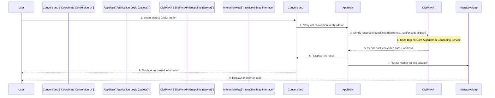

# Chapter 3: DigiPin API Endpoints

In [Chapter 2: Coordinate Conversion UI](02_coordinate_conversion_ui_.md), we learned how to use the input boxes and buttons to ask DigiPin to convert coordinates into a DigiPin code, or vice-versa. You typed in your numbers or code, clicked a button, and boom! The results appeared. But how does that actually happen behind the scenes? When you click "Generate DigiPin", where does your request go?

This is where "DigiPin API Endpoints" come into play!

### What's the Big Idea? (The Digital Gateways)

Imagine you're at a very fancy restaurant. You don't go into the kitchen to cook your meal yourself, right? You look at the menu, tell the waiter what you want, and the kitchen prepares it and sends it out.

In the world of web applications, DigiPin API Endpoints are like those **menu items** or **waiters**. They are specific "doorways" or "public phone numbers" on the DigiPin server that let the website (the part you see and interact with) ask for specific tasks, like converting a location.

**The main problem they solve:**
*   **Security:** The actual, complex math and processing (the "kitchen" or "core algorithm") happens safely on the server. The website doesn't need to know *how* to do the conversion, just *that it can ask* for it. This keeps the core logic secure and hidden.
*   **Communication:** They provide a clear, standardized way for different parts of the DigiPin system (like the interactive map or the conversion forms) to "talk" to the main brain of DigiPin without getting tangled up.
*   **Specialized Tasks:** Each endpoint is designed for a specific job, making it organized. For example, one endpoint is just for generating DigiPins, and another is just for decoding them.

Let's use our example: When you entered Latitude `28.6139` and Longitude `77.2090` into the "Coordinates to DigiPin" section and clicked "Generate DigiPin", the website didn't convert it by itself. Instead, it sent a message to the DigiPin server, saying, "Hey, I need a DigiPin for these coordinates!" This message went through a specific "DigiPin API Endpoint" designed for that purpose. The server did the work and sent the DigiPin back.

### Key Concepts of DigiPin API Endpoints

DigiPin uses a few important API endpoints for its main features:

1.  **`/api/encode-digipin`**:
    *   **What it does:** This endpoint is responsible for taking geographic coordinates (latitude and longitude) and converting them into a DigiPin code.
    *   **Think of it as:** The "Generate DigiPin" service. You send coordinates, you get a DigiPin back.

2.  **`/api/decode-digipin`**:
    *   **What it does:** This endpoint does the opposite! It takes a DigiPin code and converts it back into its original geographic coordinates (latitude and longitude).
    *   **Think of it as:** The "Find Coordinates" service. You send a DigiPin, you get coordinates back.

3.  **Address Lookup (via Geocoding Service):**
    *   A cool thing about both of these endpoints is that they don't just give you the raw DigiPin or coordinates. They also reach out to another service (a "Geocoding Service," which we'll explore in [Chapter 5: Geocoding Service Integration](05_geocoding_service_integration_.md)) to find a human-readable address for that location. This makes the results much more useful!

### How to Use DigiPin API Endpoints (Indirectly)

As a user of the DigiPin application, you don't directly "use" these endpoints by typing web addresses. Instead, the [Coordinate Conversion UI](02_coordinate_conversion_ui_.md) (the forms you interact with) does it for you automatically!

Here's how it works from your perspective:

#### Scenario 1: Coordinates to DigiPin

1.  **You Provide Input:** You enter `28.6139` (Latitude) and `77.2090` (Longitude) in the "Coordinates to DigiPin" section.
2.  **You Click:** You click the blue "Generate DigiPin" button.
3.  **UI Sends Request:** The website then quietly sends a request to the `/api/encode-digipin` endpoint on the DigiPin server. It looks something like this behind the scenes:
    `https://your-digipin-app.com/api/encode-digipin?lat=28.6139&lon=77.2090`
4.  **Server Processes:** The server receives this request, calculates the DigiPin using the core algorithm, and also fetches an address.
5.  **Server Sends Back Result:** The server sends back the result to your browser, which looks something like this (in computer language):
    ```json
    {
      "digiPin": "FC9-8J3-2K45",
      "address": "New Delhi, Delhi, India"
    }
    ```
6.  **UI Displays:** The website then takes this result and displays "FC9-8J3-2K45" in the output box and "New Delhi, Delhi, India" as the address. A blue marker also appears on the map!

#### Scenario 2: DigiPin to Coordinates

1.  **You Provide Input:** You type `FC9-8J3-2K45` into the "DigiPin Code" field.
2.  **You Click:** You click the green "Find Coordinates" button.
3.  **UI Sends Request:** The website sends a request to the `/api/decode-digipin` endpoint:
    `https://your-digipin-app.com/api/decode-digipin?digipin=FC9-8J3-2K45`
4.  **Server Processes:** The server receives this, decodes the DigiPin into coordinates, and fetches an address.
5.  **Server Sends Back Result:** The server sends back the result:
    ```json
    {
      "latitude": 28.6139,
      "longitude": 77.2090,
      "lat": 28.6139,
      "lon": 77.2090,
      "address": "New Delhi, Delhi, India"
    }
    ```
6.  **UI Displays:** The website then displays `28.6139` (Latitude) and `77.2090` (Longitude) in the output boxes, along with the address. A green marker appears on the map!

### What's Under the Hood? (How the Endpoints Work)

Let's see the journey of your request when you use the Coordinate Conversion UI, focusing on how the API endpoints fit in.



Here's a breakdown of the steps:

1.  **You Initiate:** You provide your input (coordinates or a DigiPin) and click the "Convert" button in the [Coordinate Conversion UI](02_coordinate_conversion_ui_.md).
2.  **UI to App Brain:** The `CoordinateToDigiPin.jsx` or `DigiPinToCoordinate.jsx` component (from Chapter 2) first checks your input for simple errors. If it's valid, it passes the request to the main application logic (`page.js`).
3.  **App Brain to API:** The `page.js` then makes a special "fetch" request (like sending a message) to the correct DigiPin API endpoint on the server. This is the moment your request leaves your computer and goes to the DigiPin server.
4.  **API Does the Work:** Once the DigiPin API endpoint receives the request, it does two main things:
    *   It uses the core DigiPin logic ([Chapter 4: DigiPin Core Algorithm](04_digi_pin_core_algorithm_.md)) to perform the actual conversion (e.g., coordinates to DigiPin, or DigiPin to coordinates).
    *   It also talks to an external [Geocoding Service Integration](05_geocoding_service_integration_.md) to find a human-readable address for the location.
5.  **API Sends Response:** After processing, the API endpoint sends the results (the converted data and the address) back to the `page.js` on your computer.
6.  **App Brain Updates UI & Map:** The `page.js` takes this data and updates:
    *   The `Coordinate Conversion UI` to show you the results.
    *   The `Interactive Map Interface` to display a marker at the calculated location.
7.  **You See Results:** Finally, you see the updated information in the application.

### A Closer Look at the Code

The API endpoints in DigiPin are built using a feature called "API Routes" in Next.js (the web framework used for DigiPin). These are special files that run code on the server whenever someone accesses their specific web address.

Let's look at `src/app/api/encode-digipin/route.js`:

```javascript
// File: src/app/api/encode-digipin/route.js

import { NextResponse } from 'next/server';
import { getDigiPin } from '@/lib/digipin'; // Our core conversion logic

// Function to get address from coordinates (more details in Chapter 5)
async function getAddressFromCoordinates(lat, lon) { /* ... simplified ... */ return 'Address found'; }

// This function runs when someone visits /api/encode-digipin
export async function GET(request) {
  // 1. Get latitude and longitude from the request URL
  const { searchParams } = new URL(request.url);
  const lat = parseFloat(searchParams.get('lat'));
  const lon = parseFloat(searchParams.get('lon'));

  // 2. Basic validation
  if (isNaN(lat) || isNaN(lon)) {
    return NextResponse.json({ error: 'Invalid coordinates' }, { status: 400 });
  }

  try {
    // 3. Use the DigiPin core logic to get the DigiPin
    const digiPin = getDigiPin(lat, lon);
    // 4. Get the address for the coordinates
    const address = await getAddressFromCoordinates(lat, lon);
    
    // 5. Send back the DigiPin and address as a JSON response
    return NextResponse.json({ digiPin, address });
  } catch (err) {
    return NextResponse.json({ error: err.message }, { status: 400 });
  }
}
```

**Breaking down `src/app/api/encode-digipin/route.js`:**

*   **`export async function GET(request)`**: This is the main function that runs when your browser sends a GET request to `/api/encode-digipin`. The `request` object contains all the details of the incoming request.
*   **`searchParams.get('lat')` and `searchParams.get('lon')`**: This is how the endpoint grabs the `lat` (latitude) and `lon` (longitude) values that were sent in the URL (like `?lat=28.6139&lon=77.2090`).
*   **`getDigiPin(lat, lon)`**: This is the crucial line! It calls the actual mathematical function from the [DigiPin Core Algorithm](04_digi_pin_core_algorithm_.md) to do the conversion.
*   **`getAddressFromCoordinates(lat, lon)`**: This function (which is part of the [Geocoding Service Integration](05_geocoding_service_integration_.md)) is called to find a readable address.
*   **`NextResponse.json(...)`**: This line creates the response that gets sent back to your browser. It formats the `digiPin` and `address` into a clear, structured format called JSON.

The `src/app/api/decode-digipin/route.js` works in a very similar way:

```javascript
// File: src/app/api/decode-digipin/route.js

import { NextResponse } from 'next/server';
import { getLatLngFromDigiPin } from '@/lib/digipin'; // Our core conversion logic

// Function to get address from coordinates (more details in Chapter 5)
async function getAddressFromCoordinates(lat, lon) { /* ... simplified ... */ return 'Address found'; }

// This function runs when someone visits /api/decode-digipin
export async function GET(request) {
  // 1. Get the DigiPin code from the request URL
  const { searchParams } = new URL(request.url);
  const digiPin = searchParams.get('digipin');

  // 2. Basic validation
  if (!digiPin) {
    return NextResponse.json({ error: 'DigiPin required' }, { status: 400 });
  }

  try {
    // 3. Use the DigiPin core logic to get coordinates
    const coords = getLatLngFromDigiPin(digiPin);
    // 4. Get the address for the coordinates
    const address = await getAddressFromCoordinates(coords.latitude, coords.longitude);
    
    // 5. Send back the coordinates and address as a JSON response
    return NextResponse.json({ ...coords, address });
  } catch (err) {
    return NextResponse.json({ error: err.message }, { status: 400 });
  }
}
```

**Breaking down `src/app/api/decode-digipin/route.js`:**

*   It gets the `digiPin` from the URL.
*   It calls `getLatLngFromDigiPin(digiPin)` from the [DigiPin Core Algorithm](04_digi_pin_core_algorithm_.md) to get the latitude and longitude.
*   It also calls `getAddressFromCoordinates` to get the address.
*   Finally, it sends back the `coords` (latitude, longitude) and `address` in a JSON format.

These simplified files are the heart of how your web browser requests and receives information from the DigiPin server!

### Conclusion

DigiPin API Endpoints are the secure, organized "gateways" that allow the web application to talk to the powerful server-side logic without exposing the complex internal workings. They receive your requests (like "encode this coordinate" or "decode this DigiPin"), use the [DigiPin Core Algorithm](04_digi_pin_core_algorithm_.md) to process them, and then send back the results, often including an address fetched from a [Geocoding Service Integration](05_geocoding_service_integration_.md). This separation makes DigiPin robust, secure, and easy to use.

Now that you understand *how* the front-end talks to the back-end, you might be wondering: What *is* that "DigiPin Core Algorithm" that does all the actual conversion magic? That's exactly what we'll explore in our next chapter!

[Chapter 4: DigiPin Core Algorithm](04_digi_pin_core_algorithm_.md)

---

<sub><sup>Generated by [AI Codebase Knowledge Builder](https://github.com/The-Pocket/Tutorial-Codebase-Knowledge).</sup></sub> <sub><sup>**References**: [[1]](https://github.com/Kvr-10/Digipin/blob/46da315d3734884bac31f262a43c323f70b4fddd/src/app/api/decode-digipin/route.js), [[2]](https://github.com/Kvr-10/Digipin/blob/46da315d3734884bac31f262a43c323f70b4fddd/src/app/api/encode-digipin/route.js)</sup></sub>