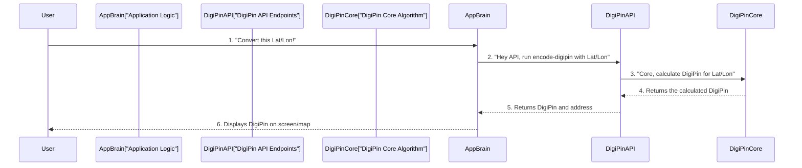

# Chapter 4: DigiPin Core Algorithm

In [Chapter 3: DigiPin API Endpoints](03_digipin_api_endpoints_.md), we learned how the "waiters" (API Endpoints) take your order (a request to convert coordinates or a DigiPin) and send it to the "kitchen" (the server). But what actually *happens* in that kitchen? How does DigiPin actually perform the magical transformation of coordinates into a unique code, and vice-versa?

This is where the "DigiPin Core Algorithm" comes in!

### What's the Big Idea? (The Math Brain)

Think of the DigiPin Core Algorithm as the **mathematical brain** or the "master chef" of the entire DigiPin system. It's the secret recipe that knows how to turn a precise spot on Earth (like `Latitude: 28.6139, Longitude: 77.2090`) into a short, unique code (like `FC9-8J3-2K45`), and also how to read that code backwards to find the exact spot again.

**The main problem it solves:**
*   **Precise Encoding:** How do we convert a precise geographic location (which uses long numbers) into a much shorter, memorable, alphanumeric code?
*   **Accurate Decoding:** How do we take that short code and get back to the *exact same* precise location, without losing any accuracy?
*   **Uniqueness:** How do we ensure that every single tiny spot on Earth gets its own unique DigiPin, and no two spots share the same code?

Let's use a simple example: Imagine you want to generate a DigiPin for your backyard swing. You give the system its exact Latitude and Longitude. The DigiPin Core Algorithm then takes these numbers, performs a series of clever calculations, and gives you back a unique 10-character code. Later, if you give that code to a friend, the *same* Core Algorithm can instantly tell them the exact Latitude and Longitude of your swing, even if they've never been there!

### Key Concepts of the Core Algorithm

The DigiPin Core Algorithm isn't just one big, complicated math problem. It breaks down the world into smaller, manageable pieces using a few clever ideas:

1.  **The DigiPin Grid (Our Special Alphabet):**
    *   DigiPin uses a special 4x4 grid of characters, like a unique alphabet. Each character in the grid represents a certain part of a bigger area.
    *   Imagine a chessboard, but instead of black and white squares, each square has a unique letter or number. This grid (`DIGIPIN_GRID` in our code) is the foundation for encoding and decoding.

    ```javascript
    // From: src/lib/digipin.js
    const DIGIPIN_GRID = [
      ['F', 'C', '9', '8'],
      ['J', '3', '2', '7'],
      ['K', '4', '5', '6'],
      ['L', 'M', 'P', 'T']
    ];
    ```
    *   This `DIGIPIN_GRID` is the set of 16 possible characters that can appear at each step of the DigiPin.

2.  **Defined Global Bounds (Our Map Area):**
    *   DigiPin doesn't cover the *entire* world at once. It focuses on a specific rectangular area. This is defined by `minLat`, `maxLat`, `minLon`, `maxLon`.
    *   Think of it as the initial map we're starting with. All DigiPins are guaranteed to fall within these boundaries.

    ```javascript
    // From: src/lib/digipin.js
    const BOUNDS = {
      minLat: 2.5,  // Southernmost Latitude
      maxLat: 38.5, // Northernmost Latitude
      minLon: 63.5, // Westernmost Longitude
      maxLon: 99.5  // Easternmost Longitude
    };
    ```
    *   This `BOUNDS` object tells the algorithm the largest possible area it needs to consider.

3.  **Recursive Division (Zooming In and Out):**
    *   This is the core magic! The algorithm works by repeatedly dividing a geographical area into smaller and smaller squares.
    *   **Imagine:** You start with a big map. You divide it into a 4x4 grid (16 squares). Your location falls into one of these squares. You pick the character from the `DIGIPIN_GRID` that matches this square.
    *   Then, you "zoom in" on *that specific square*. You divide *it* into another 4x4 grid (16 smaller squares). Your location falls into one of *those* squares. You pick the next character.
    *   You repeat this "divide and conquer" process **10 times**. Each character in the 10-character DigiPin code tells you which square to "zoom into" at each level.
    *   After 10 levels of division, you end up with a very, very tiny square. The DigiPin represents *that* tiny square.

    This process works for both:
    *   **Encoding (Coordinates to DigiPin):** You start with coordinates, find which of the 16 squares they fall into, pick a character, and then redefine your "map" to be *only* that square. You repeat this 10 times to build the DigiPin.
    *   **Decoding (DigiPin to Coordinates):** You start with the first character of a DigiPin, find its corresponding square within the initial `BOUNDS`. Then you take the next character, find its square *within that previous square*, and so on. After 10 characters, you've narrowed down to a tiny square. The coordinates of the *center* of this final tiny square are the decoded Latitude and Longitude.

    Because you divide the area 10 times (each time into 16 smaller areas), DigiPin can pinpoint locations with incredible precision!

### How to Use the Core Algorithm (Through the API)

As a user, you won't directly interact with the math functions. Instead, you use the [Coordinate Conversion UI](02_coordinate_conversion_ui_.md), which then talks to the [DigiPin API Endpoints](03_digipin_api_endpoints_.md). Those API Endpoints are the ones that call the Core Algorithm.

Let's quickly recap how your request makes its way to the Core Algorithm:



The key step here is **Step 3**, where the `DigiPinAPI` asks the `DigiPinCore` to perform the actual calculation.

### What's Under the Hood? (The Actual Math)

The core mathematical functions for encoding and decoding live in `src/lib/digipin.js`. Let's look at simplified versions of these functions.

#### 1. Encoding: `getDigiPin(lat, lon)` (Coordinates to DigiPin)

This function takes a Latitude and Longitude and builds the 10-character DigiPin.

```javascript
// From: src/lib/digipin.js (Simplified)
import { DIGIPIN_GRID, BOUNDS } from './digipin'; // These are imported from the same file

export function getDigiPin(lat, lon) {
  // 1. Basic check if coordinates are within our global map area
  // (More detailed error checks are in the full code)

  let currentMinLat = BOUNDS.minLat;
  let currentMaxLat = BOUNDS.maxLat;
  let currentMinLon = BOUNDS.minLon;
  let currentMaxLon = BOUNDS.maxLon;

  let digiPin = ''; // This will build our 10-character code

  for (let level = 1; level <= 10; level++) { // Loop 10 times for 10 characters
    // 2. Calculate the width/height of each small square in the current area
    const latDivisionSize = (currentMaxLat - currentMinLat) / 4;
    const lonDivisionSize = (currentMaxLon - currentMinLon) / 4;

    // 3. Figure out which 4x4 grid row (0-3) and column (0-3) our location falls into
    let rowIndex = 3 - Math.floor((lat - currentMinLat) / latDivisionSize);
    let colIndex = Math.floor((lon - currentMinLon) / lonDivisionSize);

    // Make sure index stays within 0-3 range (handles extreme edges)
    rowIndex = Math.max(0, Math.min(rowIndex, 3));
    colIndex = Math.max(0, Math.min(colIndex, 3));

    // 4. Add the character from our DIGIPIN_GRID to our code
    digiPin += DIGIPIN_GRID[rowIndex][colIndex];

    // 5. Add hyphens for readability (e.g., FC9-8J3-2K45)
    if (level === 3 || level === 6) digiPin += '-';

    // 6. NOW, "zoom in": Update our current area to be JUST the square we found
    currentMaxLat = currentMinLat + latDivisionSize * (4 - rowIndex);
    currentMinLat = currentMinLat + latDivisionSize * (3 - rowIndex);
    currentMinLon = currentMinLon + lonDivisionSize * colIndex;
    currentMaxLon = currentMinLon + lonDivisionSize;
  }

  return digiPin; // Here's our final DigiPin!
}
```
**What's happening here?**
*   The function starts with the `BOUNDS` (our initial large map area). These `currentMinLat`, `currentMaxLat`, `currentMinLon`, `currentMaxLon` variables define the "box" we are currently looking inside.
*   It then runs a loop 10 times, once for each character of the DigiPin.
*   In each loop, it calculates how big each of the 16 smaller squares (`latDivisionSize`, `lonDivisionSize`) would be if we divided our *current* map area.
*   It then figures out which `rowIndex` (0 to 3) and `colIndex` (0 to 3) your `lat` and `lon` fall into within this 4x4 grid.
*   It picks the character from `DIGIPIN_GRID` at that `rowIndex` and `colIndex` and adds it to the `digiPin` string.
*   Most importantly, it *updates* `currentMinLat`, `currentMaxLat`, `currentMinLon`, `currentMaxLon` to now represent *only* the small square it just found. This is like "zooming in" for the next level of the loop.
*   After 10 loops, `digiPin` holds the complete 10-character code.

#### 2. Decoding: `getLatLngFromDigiPin(digiPin)` (DigiPin to Coordinates)

This function takes a 10-character DigiPin and converts it back into Latitude and Longitude.

```javascript
// From: src/lib/digipin.js (Simplified)
import { DIGIPIN_GRID, BOUNDS } from './digipin'; // These are imported from the same file

export function getLatLngFromDigiPin(digiPin) {
  const pin = digiPin.replace(/-/g, ''); // Remove hyphens for easier processing
  // 1. Basic checks for DigiPin length and valid characters (More detailed error checks in full code)

  let currentMinLat = BOUNDS.minLat;
  let currentMaxLat = BOUNDS.maxLat;
  let currentMinLon = BOUNDS.minLon;
  let currentMaxLon = BOUNDS.maxLon;

  for (let i = 0; i < 10; i++) { // Go through each character of the DigiPin
    const char = pin[i]; // Get the current character

    let rowIndex = -1;
    let colIndex = -1;

    // 3. Find this character in our DIGIPIN_GRID to get its row and column
    for (let r = 0; r < 4; r++) {
      for (let c = 0; c < 4; c++) {
        if (DIGIPIN_GRID[r][c] === char) {
          rowIndex = r;
          colIndex = c;
          break; // Found it! Stop searching the grid
        }
      }
      if (rowIndex !== -1) break; // If found, break outer loop too
    }

    // 4. Calculate the width/height of each small square in the current area
    const latDivisionSize = (currentMaxLat - currentMinLat) / 4;
    const lonDivisionSize = (currentMaxLon - currentMinLon) / 4;

    // 5. "Zoom in": Update our current area boundaries based on the character's row/col
    currentMaxLat = currentMinLat + latDivisionSize * (4 - rowIndex);
    currentMinLat = currentMinLat + latDivisionSize * (3 - rowIndex);
    currentMinLon = currentMinLon + lonDivisionSize * colIndex;
    currentMaxLon = currentMinLon + lonDivisionSize;
  }

  // 6. After 10 levels, we have a very small final box.
  //    The middle of this box is our estimated Latitude and Longitude.
  return {
    latitude: +((currentMinLat + currentMaxLat) / 2).toFixed(6), // Get average, round to 6 decimal places
    longitude: +((currentMinLon + currentMaxLon) / 2).toFixed(6)
  };
}
```
**What's happening here?**
*   The function takes the `digiPin` (after removing hyphens) and runs a loop 10 times, one for each character.
*   In each loop, it finds where the current `char` is located in the `DIGIPIN_GRID` to get its `rowIndex` and `colIndex`.
*   Similar to encoding, it then calculates the size of the 16 potential squares (`latDivisionSize`, `lonDivisionSize`) within its `current` map area.
*   Using the `rowIndex` and `colIndex` it found, it *updates* `currentMinLat`, `currentMaxLat`, `currentMinLon`, `currentMaxLon` to be *only* the new, smaller square indicated by the character. This is like "zooming in."
*   After 10 loops, `currentMinLat`, `currentMaxLat`, `currentMinLon`, `currentMaxLon` define a very tiny square. The function then calculates the *center* of this tiny square (`(min + max) / 2`) to get the most accurate Latitude and Longitude.
*   `.toFixed(6)` makes sure the numbers are rounded nicely for display. The `+` at the beginning converts the string result of `toFixed` back into a number.

These two functions are the heart of DigiPin, allowing it to perform its core job of converting locations into codes and back again!

### Conclusion

The DigiPin Core Algorithm is the clever mathematical system that powers DigiPin's ability to translate between geographical coordinates and unique 10-character DigiPins. By using a predefined grid and repeatedly dividing areas, it can precisely pinpoint locations with increasing accuracy, both for encoding (coordinates to DigiPin) and decoding (DigiPin to coordinates). It's the "chef" in our "kitchen," performing the complex calculations so you don't have to!

While the Core Algorithm gives us precise numerical coordinates, what if we want to know the human-readable address for that location? That's where our next chapter comes in, as we explore how DigiPin integrates with external services to provide useful addresses in [Chapter 5: Geocoding Service Integration](05_geocoding_service_integration_.md)!

---

<sub><sup>Generated by [AI Codebase Knowledge Builder](https://github.com/The-Pocket/Tutorial-Codebase-Knowledge).</sup></sub> <sub><sup>**References**: [[1]](https://github.com/Kvr-10/Digipin/blob/46da315d3734884bac31f262a43c323f70b4fddd/src/lib/digipin.js), [[2]](https://github.com/Kvr-10/Digipin/blob/46da315d3734884bac31f262a43c323f70b4fddd/test_digipin.js), [[3]](https://github.com/Kvr-10/Digipin/blob/46da315d3734884bac31f262a43c323f70b4fddd/validate_samples.js)</sup></sub>