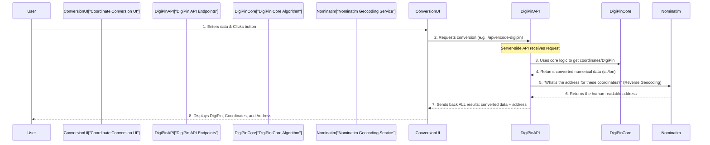

# Chapter 5: Geocoding Service Integration

In [Chapter 4: DigiPin Core Algorithm](04_digi_pin_core_algorithm_.md), we learned how DigiPin's "mathematical brain" can perfectly convert coordinates (like `28.6139, 77.2090`) into a unique DigiPin code (like `FC9-8J3-2K45`), and vice-versa. That's super precise, but what if you want to know the human-readable address for that location, like "New Delhi, Delhi, India"? Numbers are great for machines, but names are better for people!

This is where "Geocoding Service Integration" comes in!

### What's the Big Idea? (The Universal Directory)

Imagine you have a phone number, but you want to know whose house it belongs to and what their street address is. Or maybe you have a street address, and you want to find its exact phone number. A phone book or directory helps you translate between these different types of information.

In the world of maps, "Geocoding" is like that universal directory. It's the process of translating between numerical geographical coordinates (like latitude and longitude) and human-readable street addresses (like "1600 Amphitheatre Parkway, Mountain View").

**The main problem it solves for DigiPin:**
*   **Human Readability:** While DigiPins and coordinates are precise, they aren't very friendly to humans. "28.6139, 77.2090" doesn't immediately tell you it's "New Delhi". The geocoding service adds this familiar context.
*   **Enhanced User Experience:** By providing an address alongside the technical coordinates or DigiPin, the application becomes much more useful and intuitive. You don't just see a dot on a map; you see "The coffee shop on Main Street!"
*   **Data Enrichment:** It enriches the raw coordinate or DigiPin data with real-world, understandable information.

Let's use a simple example: You just generated a DigiPin for a spot in a park. The [DigiPin Core Algorithm](04_digi_pin_core_algorithm_.md) gives you the exact `latitude` and `longitude` for that DigiPin. But instead of just showing you those numbers, DigiPin automatically asks an external "Geocoding Service": "Hey, what's the address for *these* coordinates?" The service replies, "That's Central Park, New York City!" And then DigiPin displays that address right there in the results!

### Key Concepts of Geocoding

When we talk about geocoding, there are two main directions:

1.  **Geocoding (Forward Geocoding):**
    *   **What it does:** Converts a human-readable address (like "Eiffel Tower, Paris") into geographical coordinates (like `48.8584, 2.2945`).
    *   **Think of it as:** Looking up an address to find its map coordinates. (DigiPin doesn't currently use this for input, but it's a common geocoding task).

2.  **Reverse Geocoding:**
    *   **What it does:** Converts numerical geographical coordinates (like `48.8584, 2.2945`) into a human-readable address (like "Eiffel Tower, Paris").
    *   **Think of it as:** Clicking on a map and finding out the address of that spot. **This is what DigiPin primarily uses!** When you convert coordinates to a DigiPin, or decode a DigiPin back to coordinates, DigiPin then performs a reverse geocoding lookup to give you an address.

3.  **External Service (OpenStreetMap Nominatim):**
    *   Building a complete map and address database is a huge task! So, instead of doing it ourselves, DigiPin connects to an already existing, powerful service called **OpenStreetMap Nominatim**.
    *   Nominatim is a public service that uses data from OpenStreetMap (a free and open world map) to provide geocoding and reverse geocoding. It's like having access to a massive, constantly updated address book for the entire world!

### How to Use Geocoding (Behind the Scenes)

As a user, you don't directly interact with the geocoding service. It works quietly in the background, making your DigiPin experience richer. When you use the [Coordinate Conversion UI](02_coordinate_conversion_ui_.md) to generate a DigiPin or decode one, the address lookup happens automatically.

Here's how it works from your perspective:

#### Scenario 1: Coordinates to DigiPin (with Address)

1.  **You Provide Input:** You enter `28.6139` (Latitude) and `77.2090` (Longitude).
2.  **You Click:** You click the blue "Generate DigiPin" button.
3.  **DigiPin Does Its Magic:** The system generates the DigiPin (e.g., `FC9-8J3-2K45`).
4.  **Geocoding Kicks In:** Immediately, DigiPin also sends a request to the OpenStreetMap Nominatim service: "What's the address for `28.6139, 77.2090`?"
5.  **Service Responds:** Nominatim sends back the address, like `"New Delhi, Delhi, India"`.
6.  **UI Displays:** The application then shows you both the generated DigiPin and the friendly address!

#### Scenario 2: DigiPin to Coordinates (with Address)

1.  **You Provide Input:** You type `FC9-8J3-2K45` into the "DigiPin Code" field.
2.  **You Click:** You click the green "Find Coordinates" button.
3.  **DigiPin Does Its Magic:** The system decodes the DigiPin back to coordinates (e.g., `28.6139, 77.2090`).
4.  **Geocoding Kicks In:** Again, DigiPin sends a request to Nominatim: "What's the address for `28.6139, 77.2090`?"
5.  **Service Responds:** Nominatim sends back the address.
6.  **UI Displays:** The application displays the coordinates and the associated address.

### What's Under the Hood? (How Does It Work?)

Let's trace how the address lookup fits into the overall DigiPin process, focusing on the server-side integration which handles the definitive address for API results.



Here's a step-by-step breakdown:

1.  **You Start:** You enter your input in the [Coordinate Conversion UI](02_coordinate_conversion_ui_.md) and click a button.
2.  **UI Talks to API:** Your browser sends a request to one of DigiPin's [DigiPin API Endpoints](03_digi_pin_api_endpoints_.md) (like `/api/encode-digipin`).
3.  **API Uses Core Algorithm:** The API endpoint (running on the server) first calls the [DigiPin Core Algorithm](04_digi_pin_core_algorithm_.md) to get the primary conversion (e.g., if you sent coordinates, it gets the DigiPin; if you sent a DigiPin, it gets the coordinates).
4.  **API Calls Nominatim:** *After* it has the precise latitude and longitude (either from your initial input, or from decoding a DigiPin), the DigiPin API makes a *new* request to the **OpenStreetMap Nominatim** service. This is the "Geocoding Service Integration" part!
5.  **Nominatim Responds:** Nominatim processes the coordinates and sends back the most relevant human-readable address it can find.
6.  **API Combines and Sends Back:** The DigiPin API endpoint then combines the DigiPin/coordinate result *with* the address it just got from Nominatim. It sends this complete package back to your browser.
7.  **UI Displays:** Your browser receives this combined data and updates the [Coordinate Conversion UI](02_coordinate_conversion_ui_.md) to show both the numerical result and the address.

### A Closer Look at the Code

The geocoding integration happens inside the API routes (the "waiters" or "digital gateways" we discussed in [Chapter 3: DigiPin API Endpoints](03_digi_pin_api_endpoints_.md)). Both `encode-digipin` and `decode-digipin` routes use the same helper function to get an address.

Let's look at the `getAddressFromCoordinates` helper function, which is found in both `src/app/api/encode-digipin/route.js` and `src/app/api/decode-digipin/route.js`:

```javascript
// From: src/app/api/encode-digipin/route.js or src/app/api/decode-digipin/route.js

// This function talks to the Nominatim service
async function getAddressFromCoordinates(lat, lon) {
  try {
    // 1. Construct the URL for Nominatim's reverse geocoding
    const response = await fetch(
      `https://nominatim.openstreetmap.org/reverse?format=json&lat=${lat}&lon=${lon}&zoom=18&addressdetails=1`,
      {
        headers: {
          'User-Agent': 'DigiPin-App' // Good practice: identify your application
        }
      }
    );
    
    // 2. Check if the request was successful
    if (!response.ok) {
      // If not, return a default message
      return 'Address not available';
    }
    
    // 3. Get the data from Nominatim (it's in JSON format)
    const data = await response.json();
    
    // 4. Extract the main address display name
    return data.display_name || 'Address not available';
  } catch (error) {
    // If anything goes wrong, return a default message
    return 'Address not available';
  }
}
```

**What's happening here?**

*   **`async function getAddressFromCoordinates(lat, lon)`**: This function takes a `latitude` and `longitude` as input.
*   **`fetch(...)`**: This is how our server code makes a request to another web service (Nominatim, in this case).
    *   The URL `https://nominatim.openstreetmap.org/reverse` is Nominatim's specific "doorway" for reverse geocoding.
    *   `lat=${lat}&lon=${lon}` passes our coordinates to Nominatim.
    *   `format=json` tells Nominatim we want the results in a computer-readable JSON format.
    *   `zoom=18&addressdetails=1` are extra options to get more detailed address information.
    *   `'User-Agent': 'DigiPin-App'` is like telling Nominatim "Hi, I'm the DigiPin application calling!" It's a good etiquette when using public web services.
*   **`response.ok`**: Checks if Nominatim successfully received and processed our request.
*   **`data = await response.json()`**: If successful, it takes Nominatim's response (which is in JSON format) and converts it into a JavaScript object we can easily work with.
*   **`data.display_name`**: Nominatim's response contains many details, but `display_name` is usually the most complete and human-friendly address string. If `display_name` isn't available for some reason, we default to "Address not available".
*   **`try...catch`**: This is a safety net! If there's any network problem or error talking to Nominatim, our app won't crash; it will just return "Address not available."

This `getAddressFromCoordinates` function is then called within our API endpoints:

```javascript
// From: src/app/api/encode-digipin/route.js (Simplified)

import { getDigiPin } from '@/lib/digipin'; // Our core conversion logic

// (The getAddressFromCoordinates function from above would be here or imported)

export async function GET(request) {
  const { searchParams } = new URL(request.url);
  const lat = parseFloat(searchParams.get('lat'));
  const lon = parseFloat(searchParams.get('lon'));

  // ... (validation checks) ...

  try {
    const digiPin = getDigiPin(lat, lon); // Get the DigiPin
    const address = await getAddressFromCoordinates(lat, lon); // Get the address for these coordinates
    
    return NextResponse.json({ digiPin, address }); // Send both back!
  } catch (err) {
    // ... (error handling) ...
  }
}
```

And similarly for decoding:

```javascript
// From: src/app/api/decode-digipin/route.js (Simplified)

import { getLatLngFromDigiPin } from '@/lib/digipin'; // Our core conversion logic

// (The getAddressFromCoordinates function from above would be here or imported)

export async function GET(request) {
  const { searchParams } = new URL(request.url);
  const digiPin = searchParams.get('digipin');

  // ... (validation checks) ...

  try {
    const coords = getLatLngFromDigiPin(digiPin); // Get the coordinates
    // Get the address for the coordinates we just found!
    const address = await getAddressFromCoordinates(coords.latitude, coords.longitude);
    
    return NextResponse.json({ ...coords, address }); // Send both back!
  } catch (err) {
    // ... (error handling) ...
  }
}
```

This integration makes sure that every time DigiPin processes a location, it also tries to fetch a human-readable address, making the results much more complete and user-friendly.

### Conclusion

Geocoding Service Integration is DigiPin's way of bridging the gap between precise numerical location data and familiar human-readable addresses. By connecting to an external service like OpenStreetMap Nominatim, DigiPin automatically enhances its output with addresses, providing a richer and more intuitive user experience. It's the "universal directory" that translates between technical coordinates and understandable street names, all happening seamlessly behind the scenes.

Now that we understand how DigiPin handles single conversions and address lookups, what if you have a whole list of coordinates or DigiPins you need to process? Our next chapter, [Batch Processing System](06_batch_processing_system_.md), will show you how to handle many conversions at once!

---

<sub><sup>Generated by [AI Codebase Knowledge Builder](https://github.com/The-Pocket/Tutorial-Codebase-Knowledge).</sup></sub> <sub><sup>**References**: [[1]](https://github.com/Kvr-10/Digipin/blob/46da315d3734884bac31f262a43c323f70b4fddd/src/app/api/decode-digipin/route.js), [[2]](https://github.com/Kvr-10/Digipin/blob/46da315d3734884bac31f262a43c323f70b4fddd/src/app/api/encode-digipin/route.js), [[3]](https://github.com/Kvr-10/Digipin/blob/46da315d3734884bac31f262a43c323f70b4fddd/src/components/BatchProcessor.jsx), [[4]](https://github.com/Kvr-10/Digipin/blob/46da315d3734884bac31f262a43c323f70b4fddd/src/components/CoordinateToDigiPin.jsx), [[5]](https://github.com/Kvr-10/Digipin/blob/46da315d3734884bac31f262a43c323f70b4fddd/src/components/DigiPinToCoordinate.jsx)</sup></sub>