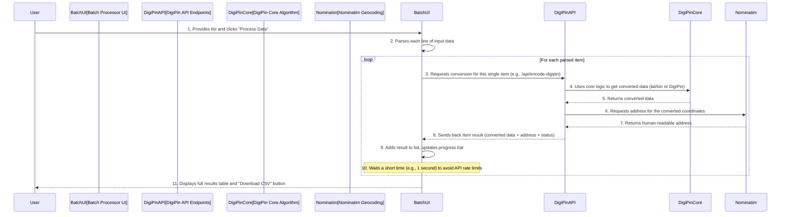

# Chapter 6: Batch Processing System

In our previous chapters, especially [Chapter 2: Coordinate Conversion UI](02_coordinate_conversion_ui_.md), we learned how to convert a single set of coordinates to a DigiPin, or a single DigiPin back to coordinates. We saw how the [DigiPin API Endpoints](03_digipin_api_endpoints_.md), the [DigiPin Core Algorithm](04_digi_pin_core_algorithm_.md), and [Geocoding Service Integration](05_geocoding_service_integration_.md) work together to give you precise results, including a human-readable address.

That's great for one-off conversions! But what if you have a **long list** of locations you need to convert? Imagine you've surveyed 100 different points in a city, and you need a DigiPin for each one. Or perhaps a colleague sent you 50 DigiPins, and you need to find all their exact coordinates and addresses. Doing these one by one would be very tedious and time-consuming!

This is where the "Batch Processing System" comes in!

### What's the Big Idea? (Your Automated Conversion Factory)

Think of the Batch Processing System as your own **automated factory line** for DigiPin conversions. Instead of manually entering each item and clicking "convert" repeatedly, you simply give the system a bulk order of inputs. It then processes them one after another, provides updates on its progress, and finally delivers a comprehensive report with all the results in a neat, downloadable file.

**The main problems it solves:**
*   **Time-saving:** No more manually converting one by one! You can process dozens, hundreds, or even thousands of conversions in one go.
*   **Efficiency:** It automates the repetitive task, freeing you up for other work.
*   **Comprehensive Results:** It collects all the output data (DigiPins, coordinates, addresses, and any errors) into a single, organized report.
*   **Error Reporting:** If some inputs are invalid or fail to convert, it clearly tells you which ones, so you can easily fix them.

Let's use our example: You have a text file with 100 lines, and each line is a `latitude,longitude` pair. You want to get the DigiPin and address for every single one. With the Batch Processing System, you simply copy and paste all 100 lines, click "Process," and wait a short while. When it's done, you'll get a detailed spreadsheet (CSV file) with the original coordinates, the generated DigiPin, and the address for each of those 100 points!

### Key Concepts of the Batch Processing System

The Batch Processing System is designed to make bulk conversions easy and transparent:

1.  **Bulk Input Area:** This is a large text box where you paste all your coordinates or DigiPins. Each item should be on its own line.
2.  **Processing Type Selector:** You choose if you want to convert "Coordinates to DigiPins" or "DigiPins to Coordinates." This tells the system how to interpret your input.
3.  **Queue Processing:** The system doesn't try to convert everything at once. It takes each item from your input list and processes it one by one in a systematic order (like items moving through a queue or conveyor belt).
4.  **Progress Updates:** As items are processed, you'll see a progress bar move, showing you how much of the task is complete (e.g., 25%, 50%, 100%).
5.  **Detailed Results Table:** Once finished, all the results are displayed in a table on the screen, showing the input, the output (DigiPin or coordinates), the address, and whether the conversion was successful or if there was an error.
6.  **CSV Download:** The most powerful feature! You can download all the results, including original inputs, conversions, addresses, and status, into a Comma Separated Values (CSV) file. This file can be opened in any spreadsheet program (like Microsoft Excel, Google Sheets, or LibreOffice Calc) for easy review, filtering, and further analysis.

### How to Use the Batch Processing System

You'll find the Batch Processing System by clicking the "Batch Processing" tab in the DigiPin application.

1.  **Navigate to Batch Processing:**
    *   Open the DigiPin application.
    *   In the header (top part of the screen), click on the "Batch Processing" button. The layout will change to show the batch processing interface.

2.  **Select Processing Type:**
    *   You'll see two large buttons: "Coordinates → DigiPins" and "DigiPins → Coordinates".
    *   Click the one that matches what you want to convert. For our example, click **"Coordinates → DigiPins"**.

3.  **Prepare Your Input Data:**
    *   In the large text area labeled "Input Data," you'll paste your list.
    *   **For Coordinates → DigiPins:** Each line should be `latitude,longitude`.
        *   Example:
            ```
            28.6139,77.2090
            19.0760,72.8777
            13.0827,80.2707
            ```
    *   **For DigiPins → Coordinates:** Each line should be a DigiPin code.
        *   Example:
            ```
            F98-JC3-27K4
            C92-832-7K56
            J32-745-6LMP
            ```
    *   You can click "Load Sample Data" to see examples, or "Clear All" to empty the text area and results.

4.  **Start Processing:**
    *   Once your data is pasted, click the blue **"Process Data"** button.
    *   The "Processing..." text and a spinning icon will appear, and a progress bar will start filling up.

5.  **Review Results:**
    *   As the processing completes for each item, the results table below will start populating.
    *   You'll see:
        *   The original line number
        *   The input data (coordinates or DigiPin)
        *   The converted output (DigiPin or coordinates)
        *   The associated address
        *   A "Status" indicating "Success" (with a green checkmark) or "Error" (with a red triangle).

6.  **Download Your Report:**
    *   After all items are processed and the progress bar reaches 100%, a green **"Download CSV"** button will become available.
    *   Click this button, and a CSV file (e.g., `digipin_batch_results_2023-10-27.csv`) will be downloaded to your computer. You can open this file with any spreadsheet program to easily view, sort, and analyze all your conversion results.

### What's Under the Hood? (How Does It Work?)

The Batch Processing System works by taking your large list of inputs and systematically sending each one to the DigiPin server for processing, much like how the single conversion UI does it, but automated.

Here's a step-by-step breakdown of what happens when you click "Process Data":



1.  **You Initiate:** You paste your data and click "Process Data."
2.  **Input Parsing:** The `BatchProcessor` component (which is the code behind the UI) first takes your entire input text and `parseInputData` function (from the code below) splits it into individual lines. It also does a quick check for basic formatting errors on each line (e.g., "are there two numbers for coordinates?").
3.  **Looping and API Calls:** The system then enters a loop. For each valid item in your list, it performs the following:
    *   It constructs a request to the appropriate [DigiPin API Endpoint](03_digi_pin_api_endpoints_.md) (`/api/encode-digipin` for coordinates or `/api/decode-digipin` for DigiPins), similar to how the single conversion UI does.
    *   This API call is handled by the server. The server uses the [DigiPin Core Algorithm](04_digi_pin_core_algorithm_.md) to do the precise conversion.
    *   It then contacts the [Geocoding Service Integration](05_geocoding_service_integration_.md) (OpenStreetMap Nominatim) to fetch a human-readable address for the location.
    *   The API endpoint on the server then sends back the complete result (DigiPin, coordinates, address, and whether it was successful) to the `BatchProcessor` in your browser.
4.  **Progress and Collection:** As each result comes back, the `BatchProcessor` adds it to an internal list, updates the progress percentage, and redraws the results table.
5.  **Delay for Smoothness:** Importantly, after processing each item, the system intentionally pauses for a very short time (like 1 second). This is a crucial step for a "batch" system that relies on external services (like the Nominatim Geocoding Service) to avoid overwhelming them with too many requests too quickly, which could lead to errors.
6.  **Final Report:** Once all items have been processed, the loading indicator disappears, the results table is complete, and the "Download CSV" button becomes active.

### A Closer Look at the Code

The Batch Processing System's logic is primarily found in `src/components/BatchProcessor.jsx`.

Let's look at simplified key parts:

#### 1. Parsing the Input Data

This function takes the raw text area content and turns it into a list of items ready for processing.

```javascript
// From: src/components/BatchProcessor.jsx (Simplified)

const parseInputData = () => {
  const lines = inputData.trim().split('\n').filter(line => line.trim() !== '');
  const parsed = [];

  for (let i = 0; i < lines.length; i++) {
    const line = lines[i].trim();
    if (processingType === 'coordinates') {
      const coords = line.split(',').map(c => c.trim());
      if (coords.length === 2 && !isNaN(parseFloat(coords[0])) && !isNaN(parseFloat(coords[1]))) {
        parsed.push({ lat: parseFloat(coords[0]), lon: parseFloat(coords[1]), index: i + 1 });
      } else {
        parsed.push({ error: `Invalid coordinates on line ${i + 1}: ${line}`, index: i + 1 });
      }
    } else { // processingType === 'digipins'
      const cleanPin = line.replace(/-/g, '').toUpperCase();
      if (cleanPin.length === 10) {
        parsed.push({ digiPin: line, index: i + 1 });
      } else {
        parsed.push({ error: `Invalid DigiPin on line ${i + 1}: ${line}`, index: i + 1 });
      }
    }
  }
  return parsed;
};
```
**What's happening here?**
*   `inputData.trim().split('\n')`: This takes all the text you pasted, removes any extra spaces at the beginning/end, and splits it into an array (list) of `lines` based on where you pressed Enter.
*   The `for` loop then goes through each `line`.
*   Inside the loop, it checks `processingType` to see if you're converting coordinates or DigiPins.
*   It then tries to parse the `line` (e.g., splitting by comma for coordinates, or checking length for DigiPins).
*   If a line looks valid, it adds it to the `parsed` list. If it's invalid, it adds an `error` message for that specific line. This way, even bad inputs are recorded!

#### 2. Processing the Data (Making API Calls)

This is the core loop that talks to our DigiPin server for each item.

```javascript
// From: src/components/BatchProcessor.jsx (Simplified)

const processData = async () => {
  const parsedData = parseInputData(); // Get the cleaned list of inputs
  // ... (reset state: loading, errors, results, progress) ...

  const processedResults = [];
  const total = parsedData.length;

  for (let i = 0; i < parsedData.length; i++) {
    const item = parsedData[i];
    if (item.error) { // If parsing already found an error for this line
      processedResults.push({ ...item, status: 'error' });
    } else {
      try {
        let response;
        if (processingType === 'coordinates') {
          response = await fetch(`/api/encode-digipin?lat=${item.lat}&lon=${item.lon}`);
        } else {
          response = await fetch(`/api/decode-digipin?digipin=${encodeURIComponent(item.digiPin)}`);
        }
        const data = await response.json();

        if (response.ok) { // Check if the server responded successfully
          processedResults.push({ ...item, ...data, status: 'success' });
        } else { // Server returned an error (e.g., invalid DigiPin)
          processedResults.push({ ...item, error: data.error || 'Failed', status: 'error' });
        }
      } catch (err) { // Network or unexpected error
        processedResults.push({ ...item, error: err.message, status: 'error' });
      }
    }
    setProgress(Math.round(((i + 1) / total) * 100)); // Update progress bar
    setResults([...processedResults]); // Update results table displayed
    await new Promise(resolve => setTimeout(resolve, 1000)); // Crucial delay
  }
  setLoading(false);
};
```
**What's happening here?**
*   `parseInputData()`: First, it calls the parsing function we just discussed to get a clean list of items.
*   `for (let i = 0; i < parsedData.length; i++)`: This loop iterates through each item in your parsed list.
*   `await fetch(...)`: This is where the magic happens! For each item, it sends a request to our [DigiPin API Endpoints](03_digi_pin_api_endpoints_.md) on the server.
    *   It smartly chooses between `/api/encode-digipin` (for coordinates) or `/api/decode-digipin` (for DigiPins) based on your `processingType` selection.
*   `response.ok` and `try...catch`: These lines are for handling good and bad responses from the server, making sure our app doesn't crash if something goes wrong with a particular conversion.
*   `processedResults.push(...)`: After each conversion, the result (including status and error messages) is added to a list.
*   `setProgress(...)` and `setResults([...processedResults])`: These lines update the progress bar and the on-screen table as new results come in, so you can see what's happening.
*   `await new Promise(resolve => setTimeout(resolve, 1000));`: This is the **delay**. It tells the program to wait for 1000 milliseconds (1 second) before processing the next item. This is very important when using external services (like the Nominatim Geocoding service used by our API), as they often have limits on how many requests you can make per second. This delay helps us stay within those limits and ensures reliable processing.

#### 3. Downloading Results as CSV

This function neatly organizes all your collected results into a spreadsheet-friendly format.

```javascript
// From: src/components/BatchProcessor.jsx (Simplified)

const downloadResults = () => {
  if (results.length === 0) return;

  let csvContent = '';
  if (processingType === 'coordinates') {
    csvContent = 'Line,Latitude,Longitude,DigiPin,Address,Status,Error\n';
    results.forEach(result => {
      csvContent += `${result.index},${result.lat || ''},${result.lon || ''},${result.digiPin || ''},"${result.address || ''}",${result.status},"${result.error || ''}"\n`;
    });
  } else { // processingType === 'digipins'
    csvContent = 'Line,DigiPin,Latitude,Longitude,Address,Status,Error\n';
    results.forEach(result => {
      csvContent += `${result.index},"${result.digiPin || ''}",${result.lat || ''},${result.lon || ''},"${result.address || ''}",${result.status},"${result.error || ''}"\n`;
    });
  }

  // Code to create a downloadable file in the browser
  const blob = new Blob([csvContent], { type: 'text/csv' });
  const url = window.URL.createObjectURL(blob);
  const a = document.createElement('a');
  a.href = url;
  a.download = `digipin_batch_results_${new Date().toISOString().slice(0, 10)}.csv`;
  a.click();
  window.URL.revokeObjectURL(url);
};
```
**What's happening here?**
*   `csvContent = '...'`: This creates the header row for your CSV file (e.g., "Line,Latitude,Longitude,...").
*   `results.forEach(result => { ... })`: This loop goes through every single result that was collected during processing.
*   `csvContent += \`...\`:`: For each `result`, it formats the data into a single line, separating values with commas. The `"` around address and error messages handle cases where these might contain commas, ensuring they stay as one cell in the spreadsheet.
*   The rest of the code is standard web browser magic to create a temporary "download link" for your `csvContent` and then automatically "click" it to start the download.

These functions work together to provide a robust and user-friendly system for handling large sets of DigiPin conversions efficiently.

### Conclusion

The Batch Processing System is a powerful addition to DigiPin, transforming it from a single-item converter into an automated factory for location data. By allowing you to input multiple coordinates or DigiPins at once, providing real-time progress updates, and compiling all results into a convenient, downloadable CSV file, it significantly boosts your productivity and simplifies handling large datasets. It's an essential tool for anyone working with numerous geographical points, ensuring accurate conversions and clear reporting with minimal effort.

This chapter concludes our journey through the DigiPin project. We started with the visual [Interactive Map Interface](01_interactive_map_interface_.md), moved to the hands-on [Coordinate Conversion UI](02_coordinate_conversion_ui_.md), peeked behind the curtain at the [DigiPin API Endpoints](03_digi_pin_api_endpoints_.md) that connect everything, understood the genius of the [DigiPin Core Algorithm](04_digi_pin_core_algorithm_.md) that does the math, and saw how [Geocoding Service Integration](05_geocoding_service_integration_.md) adds human-readable context. Finally, we explored how the Batch Processing System ties all these pieces together for efficient, large-scale operations. We hope this tutorial has given you a clear and beginner-friendly understanding of how DigiPin works!

---

<sub><sup>Generated by [AI Codebase Knowledge Builder](https://github.com/The-Pocket/Tutorial-Codebase-Knowledge).</sup></sub> <sub><sup>**References**: [[1]](https://github.com/Kvr-10/Digipin/blob/46da315d3734884bac31f262a43c323f70b4fddd/src/app/page.js), [[2]](https://github.com/Kvr-10/Digipin/blob/46da315d3734884bac31f262a43c323f70b4fddd/src/components/BatchProcessor.jsx)</sup></sub>