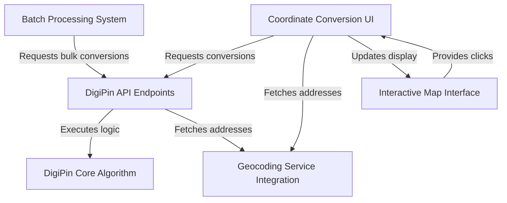

# Tutorial: Digipin

The DigiPin project is a web application that *translates* precise geographical locations into unique 10-character **DigiPins**, and can *decode* those DigiPins back into coordinates. It offers an **interactive map** for visual selection, supports both *single* and *bulk* conversions, and enhances results with **human-readable addresses** by integrating with external geocoding services.

## Visual Overview

## Chapters

1. [Interactive Map Interface
](01_interactive_map_interface_.md)
2. [Coordinate Conversion UI
](02_coordinate_conversion_ui_.md)
3. [DigiPin API Endpoints
](03_digipin_api_endpoints_.md)
4. [DigiPin Core Algorithm
](04_digipin_core_algorithm_.md)
5. [Geocoding Service Integration
](05_geocoding_service_integration_.md)
6. [Batch Processing System
](06_batch_processing_system_.md)

---

Generated by [AI Codebase Knowledge Builder](https://github.com/The-Pocket/Tutorial-Codebase-Knowledge).